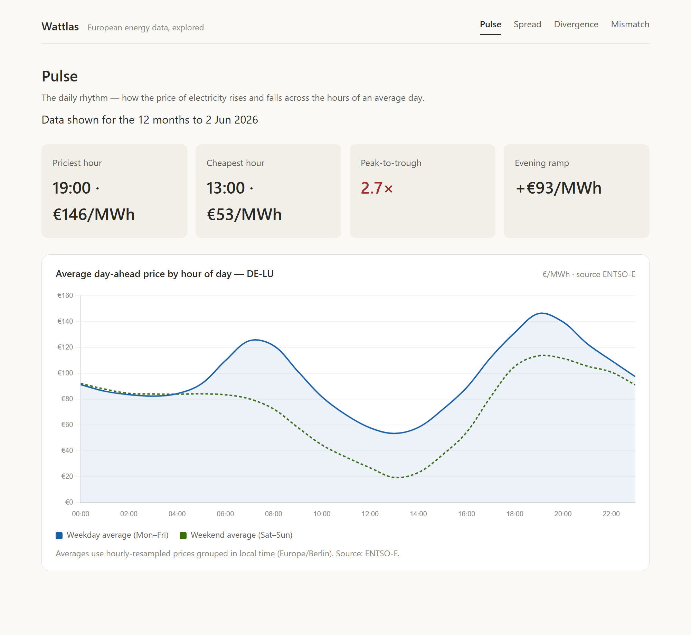
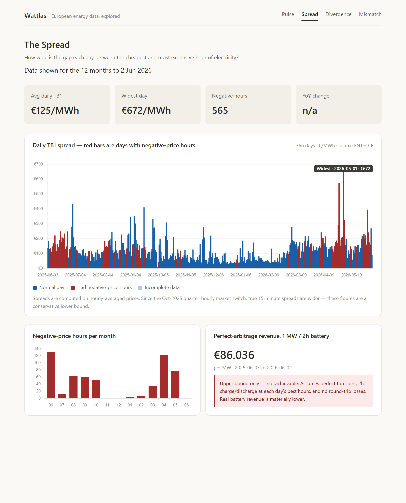
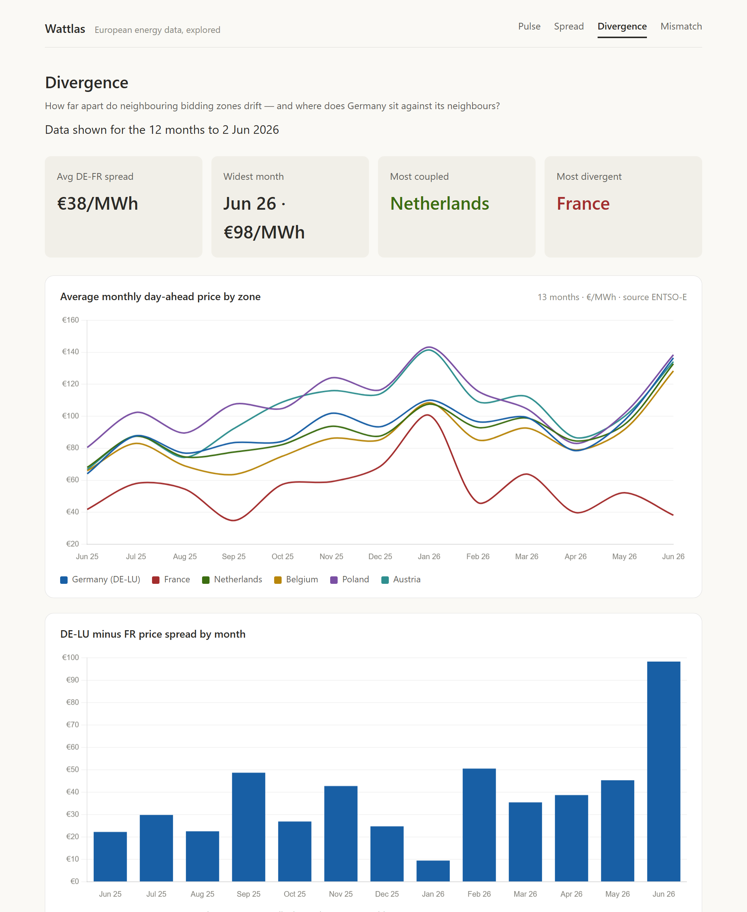
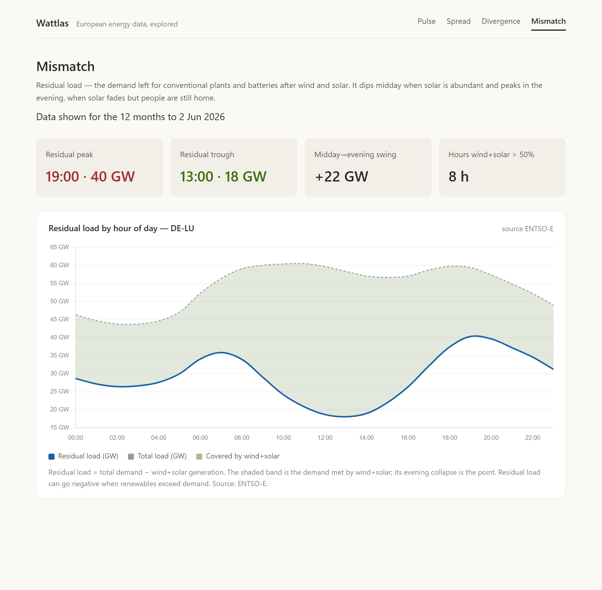

# Wattlas

**Explore when — and how much — the price of electricity moves in Europe.**

🔗 **Live site: https://sekond.github.io/Wattlas/**

## About

Wattlas turns open European electricity-market data into four explorable views
of how — and when — the price of power moves in Germany (the DE-LU bidding zone).
It runs on live data from the ENTSO-E Transparency Platform, pre-computed into a
static site with no backend.

It started as a way to learn the data terrain of European power markets, and grew
into a small tool that surfaces a few genuinely interesting things about them.

### The four views

#### Pulse — the daily rhythm

Average day-ahead price by hour of day, weekday vs weekend. Shows the classic
"duck curve": prices crater around midday when solar floods the grid, then spike
in the evening as the sun drops and demand peaks.



#### Spread — the financial core

The daily gap between the cheapest and most expensive hour (the Top-Bottom
spread), with negative-price days highlighted. This is the signal that matters
most to battery storage and arbitrage.



#### Divergence — geography

How far neighbouring bidding zones drift apart, and where Germany sits against
France, the Netherlands, Belgium, Poland and Austria. Reveals structural facts
like France's nuclear fleet keeping its prices consistently below its neighbours'.



#### Mismatch — residual load

Total demand minus wind and solar, by hour of day: the demand that conventional
plants and batteries must still cover. It dips midday when renewables are
abundant and peaks in the evening — which is exactly why prices peak then too.



### How it works

```
ENTSO-E API  →  pipeline/ (Python/pandas)  →  data/*.json  →  frontend/ (static JS)  →  GitHub Pages
```

The **pipeline** is the only thing that touches ENTSO-E. It fetches ~12 months of
data, computes each view's metrics, and writes small pre-aggregated JSON files.
Those files are committed to the repo, so the **frontend** — vanilla JS with
[Chart.js](https://www.chartjs.org/) from a CDN, no build step, no framework, no
backend — just reads them and renders. Nothing is computed in the browser and
there's nothing to break from a live API outage.

A scheduled **GitHub Action** re-runs the pipeline daily (05:17 UTC) and commits
the refreshed JSON to `main`; GitHub Pages redeploys automatically.

## Run it locally

1. Get a free ENTSO-E API token: https://transparency.entsoe.eu (Account
   Settings → Web API Security Token).
2. `cp .env.example .env` and paste your token in.
3. Install deps: `pip install -r requirements.txt`
4. Build the data — one script per view (each supports `--use-cache` for offline
   re-runs once fetched):
   ```
   python pipeline/build_spread.py        # The Spread  -> data/spread*.json
   python pipeline/build_pulse.py         # Pulse       -> data/pulse.json
   python pipeline/build_divergence.py    # Divergence  -> data/divergence.json
   python pipeline/build_mismatch.py      # Mismatch    -> data/mismatch.json
   ```
5. Serve the repo root and open the site:
   `python -m http.server 8000` then visit `http://localhost:8000/` (Pulse is the
   landing page).

> The repo ships with real data already in `data/`, so step 5 works before you
> ever run the pipeline.

### Updating the data

Every normal build caches the raw fetched series to `data/_raw_*.parquet`
(gitignored). Re-run any script with `--use-cache` to rebuild the JSON from that
cache **without touching the ENTSO-E API** — useful for iterating on metrics or
recovering from an outage. In production this is automated by the daily GitHub
Action; locally it's a manual run.

## Project structure

- `pipeline/metrics.py` — pure, testable metric computations (shared across views)
- `pipeline/build_*.py` — one fetch+compute+write script per view
- `pipeline/test_metrics.py`, `pipeline/test_build.py` — offline unit tests
- `data/schema.md` — the JSON contract between pipeline and frontend
- `frontend/index.html` — Spread view; `frontend/{pulse,divergence,mismatch}.html` — the other views
- `frontend/util.js`, `frontend/styles.css` — shared frontend helpers and styles
- `.github/workflows/refresh-data.yml` — daily data refresh

## Data notes & caveats

These are the non-obvious facts the pipeline is built around:

- **Bidding zones, not countries.** Germany trades as the combined **DE-LU** zone,
  shared with Luxembourg.
- **A resolution break in Oct 2025.** The German day-ahead market switched from
  hourly to quarter-hourly settlement. Everything is resampled to a single hourly
  grid before metrics are computed — so post-Oct spreads are a *conservative lower
  bound* on the true 15-minute spread, never an overstatement.
- **Timezones & DST.** Days are grouped in local (Europe/Berlin) time, so a day
  can legitimately have 23 or 25 hours.
- **Negative prices are real.** They are kept, never clipped — and residual load
  (Mismatch) can likewise go negative when renewables exceed demand.
- **The arbitrage figure is an upper bound.** It assumes perfect foresight and no
  losses, so it materially overstates achievable battery revenue. It is always
  labelled as such in the UI. Don't quote it as a target.

## Tests

```
python pipeline/test_metrics.py
python pipeline/test_build.py
```

Metric functions are pure and tested offline (DST days — both the 23-hour spring
and 25-hour autumn switch, the Oct-2025 resolution break, negative prices,
data-gap days, TB2 fallback, hour-of-day and monthly aggregations). `test_build.py`
runs the full `build()` against a fixture into a temp directory and asserts the
JSON is written with schema-correct keys — all without network.
